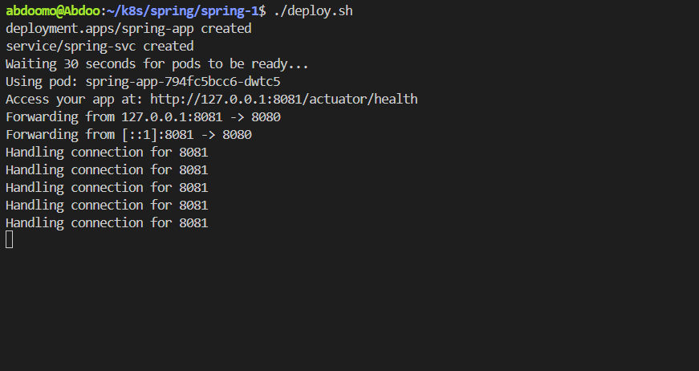
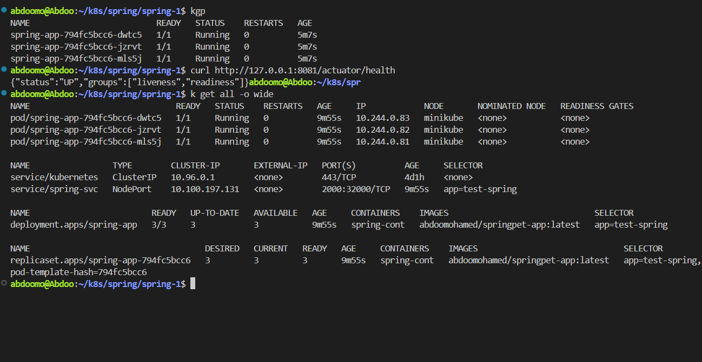
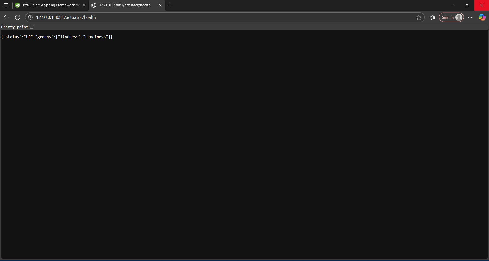
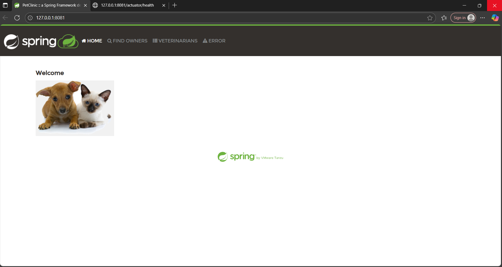
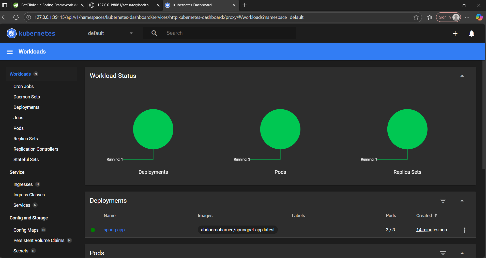
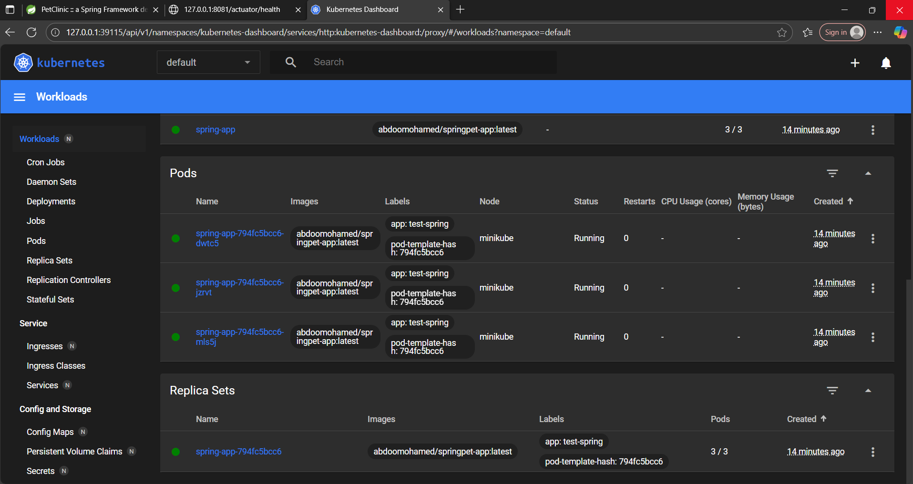

# Kubernetes Spring Boot Deployment

This project demonstrates the deployment and monitoring of a **Spring Boot** application (PetClinic) in a **Kubernetes** environment using `minikube`. It includes **Spring Boot Actuator** for health checks and exposes the application locally using **port-forwarding**.

---

## Project Structure

- `deploy.yaml` : Defines the **Deployment** for the Spring Boot application.
- `svc.yaml` : Defines a **NodePort Service** for accessing the application.
- `deploy.sh` : Script to deploy the application and start **port-forwarding**.
- `screenshots/` : Folder containing screenshots illustrating each stage of deployment and monitoring.

---

## Deployment Steps

1. Run the deployment script:

```bash
./deploy.sh
````

2. The script will:

   * Apply the **Deployment** and **Service** manifests in Kubernetes.
   * Wait 30 seconds for the **Pods** to be ready.
   * Start **port-forwarding** from local port `8081` to pod port `8080`.
   * Display the application and Actuator endpoint:

```
Access your app at: http://127.0.0.1:8081/actuator/health
```

---

## Screenshots

### 1. Deployment Script (`script.png`)

* Running `./deploy.sh` to create **Deployment** and **Service**.
* Port-forward opens `127.0.0.1:8081` to access the app and Actuator.

### 2. Kubernetes Resources (`all.png`)

* Shows 3 Pods running, Service and Deployment created successfully.
* Health endpoint returns: `{"status":"UP","groups":["liveness","readiness"]}`

### 3. Spring Boot Actuator (`actuator.png`)

* Health endpoint in browser confirming the application is running.

### 4. Application UI (`spring.png`)

* Spring PetClinic frontend accessible at `127.0.0.1:8081`.

### 5. Kubernetes Dashboard (`dash1.png` & `dash2.png`)


* Visual overview of **Workloads**, **Pods**, **ReplicaSets**, and **Deployments**.
* Confirms all resources are running as expected.

## Notes

* The project uses **liveness** and **readiness probes** for Pod health:

```yaml
livenessProbe:
  httpGet:
    path: /actuator/health
    port: 8080
  initialDelaySeconds: 30
  periodSeconds: 10

readinessProbe:
  httpGet:
    path: /actuator/health
    port: 8080
  initialDelaySeconds: 10
  periodSeconds: 5
```

* You can access the application locally via:

```
http://127.0.0.1:8081
```

---

## Running Kubernetes Dashboard

To launch the **Kubernetes Dashboard** in minikube:

```bash
minikube dashboard
```

Navigate to the **Workloads** section to monitor Deployments and Pods.

## License

Educational project.

